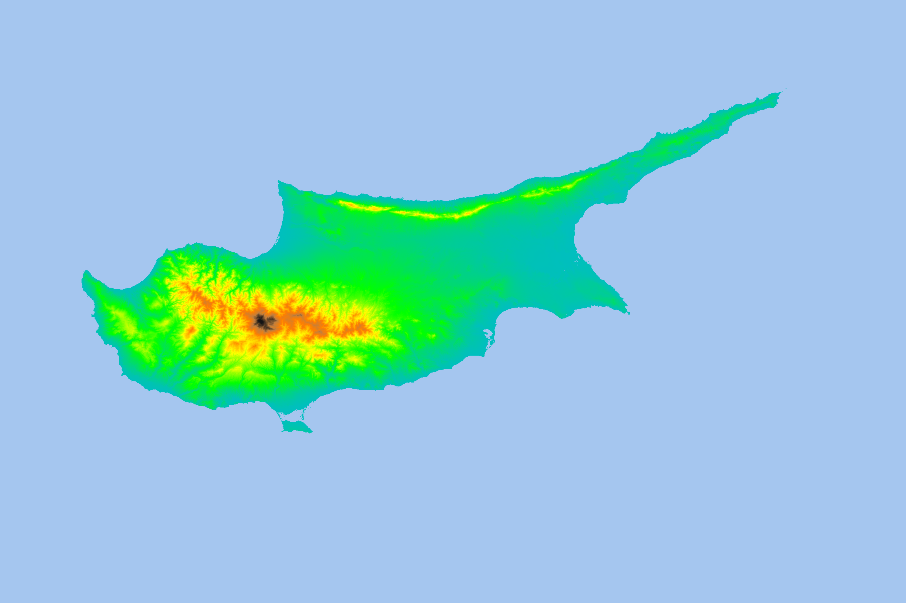

# A simplistic DEM Downloader: demloader

This package is a single purpose downloader for global Copernicus Digital Elevation Models.
The data is stored on AWS open data portal, for full information about the data product follow this link https://registry.opendata.aws/copernicus-dem/

There are two ways to use the provided code. 

## Prerequisites & Installation

The most important prerequisite is GDAL (https://gdal.org/download.html), please make sure your GDAL installation is working before proceeding.

### Command Line Use Prerequisites

To use the downloader via command line all dependencies need to be installed on your system. The easiest way is to use `pip` package manager and the provided `requirements.txt` file. Run the following command **after installing GDAL**:

`pip install requirements.txt`

### Python Library Use Prerequisites

All dependencies will be automatically installed when installing `demloader` via `pip`. Run the following command line **after installing GDAL**:

`pip install demloader`

## Intended Use (as Python Library)

The library can be used by either providing an explicit AOI (Area of Interest) in WGS84 coordinates or by providing a raster from which the extent can be extracted.

Both examples below use an example AOI covering the island of Cyprus.

**Example use given an expiclite AOI:**

```Python
import demloader as dl

aoi = [32.24734393560411, 34.52563993529248, 34.62223422263325, 35.719472334824665] # Set by user
resolution = 30 # Set by user, 30m and 90m available
output_path = 'data/cyprus_dem.tif' # Optional, default is 'demloader_dem.tif'

prefixes = dl.prefixes.get_from_aoi(aoi, resolution)
dl.download.from_aws(prefixes, resolution, output_path)
```




**Example use given a reference raster:**

```Python
import demloader as dl

reference_raster_path = 'data/example.tif' # Set by user, any projection works
resolution = 30 # Set by user, 30m and 90m available
output_path = 'data/example_output_dem.tif' # Optional, default is 'demloader_dem.tif'

prefixes dl.prfixes.get_from_raster(reference_raster_path, resolution)
dl.download.from_aws(prefixes, resolution, output_path)
```

## Intended Use (as Command Line)

After installation you can use the code via command line. First navigate to the folder containing `demloader_cli.py` and the `demloader` folder. 

```cmd
python -m demloader_cli [-h] [-aoi AOI AOI AOI AOI] [--res RESOLUTION]
                        [--raster RASTER] [--out OUTPATH]
```

For details about proper usage type `python -m demloader_cli --help`

The same examples as before are shown in command line form below:

**Example use given an expiclite AOI:**
```cmd
python -m demloader_cli -aoi 32.24734393560411 34.52563993529248 34.62223422263325 35.719472334824665 
                        --res 30 --out data/cyprus.tif
```

**Example use given a reference raster:**

```cmd
python -m demloader_cli --raster data/example.tif --res 30 --out data/example_output_dem.tif
```